# DiffFlatQuad
<p align="center">
  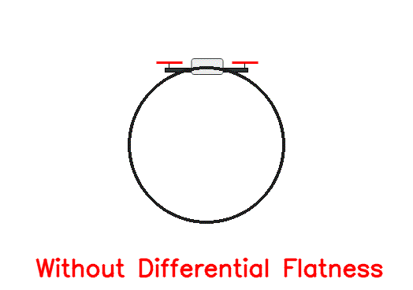
  
</p>
This repository is a tody example of employing differential flatness theory to control a simulated 2D planar quadrotor. Given the desired trajectory for the differentially flat outputs of the system, differential flatness theory provides the functions required to compute the full state trajectory and control inputs that lead to that desired output trajectory. Combined with a low-gain PID controller to keep the drone close to the desired path, the differential flatness allows the computation of feed-forward terms that greatly improve the tracking performance.


## The Plant and Its Controllability
The system considered in this project is a planar quadrotor:
<p align="center">
  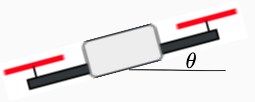
</p>

and is described using 6 states as follows:

<!-- $
\left[\begin{matrix}\operatorname{\dot{x}_{1}}{\left(t \right)}\\\operatorname{\dot{x}_{2}}{\left(t \right)}\\\operatorname{\dot{x}_{3}}{\left(t \right)}\\\operatorname{\dot{x}_{4}}{\left(t \right)}\\\operatorname{\dot{x}_{5}}{\left(t \right)}\\\operatorname{\dot{x}_{6}}{\left(t \right)}\end{matrix}\right] = 
\left[\begin{matrix}\operatorname{x_{2}}{\left(t \right)}\\- \frac{\operatorname{u_{1}}{\left(t \right)} \sin{\left(\operatorname{x_{5}}{\left(t \right)} \right)}}{m}\\\operatorname{x_{4}}{\left(t \right)}\\- g + \frac{\operatorname{u_{1}}{\left(t \right)} \cos{\left(\operatorname{x_{5}}{\left(t \right)} \right)}}{m}\\\operatorname{x_{6}}{\left(t \right)}\\\frac{\operatorname{u_{1}}{\left(t \right)}}{J}\end{matrix}\right]
$ -->
<p align="center">
  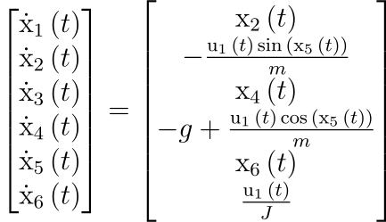
</p>

Here $x_1, x_3, x_5$ are body $x, \ y, \ \theta$ pose parameters, and $x_2, x_4, x_6$ are the corresponding time derivitives ($v_x, v_y, \omega$). The inputs $u_1, \ u_2$ are collective thrust, $F$, and applied torque, $\tau$ by the actuators. These values are linear functions of individual propeller thrust values:
<!-- $
\begin{align}
\tau =& \frac{F_2-F_1}{l}\\
F =& \frac{F_2+F_1}{2}
\end{align}
$ -->

<p align="center">
  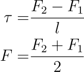
</p>

where $F_1$ and $F_2$ are the thrust produced by the individual propellers and $l$ is the length from the center of the drone to the motor attachment point. Finally, mass and inertia are represented with $m, J$, and gravity with $g$.

**Note:** Rotational dynamics is decoupled from the position and is described by a double integration of the inertia-normalized body torque. As such, quadrotors usually have a cascade control structure where the inner-loop controller exercises control over the body angular rate, and the other-loop control maintains the body pose tracking.  

Here, we provide a simple simulator based on Pygame that can be instantiated as follows: 

```python
from DiffFlatQuad.robot import PlanerQuadrotor
quadrotor = PlanerQuadrotor(rendering=True, dt=1e-2)
#The simulation loop
while quadrotor.running():
    quadrotor.step(T=0.0000, F=9.8)
    time.sleep(0.01)
```

### Controllability Analysis
Before moving on to the control design, we first need to investigate the controllability of the plant under study. First, note that the plant may be put into control-affine forms as:

<!-- \mathbf{\dot{x}} = &\mathbf{f}(\mathbf{x})+\mathbf{g_1}(\mathbf{x})u_1+ \mathbf{g_2}(\mathbf{x})u_2\\
\mathbf{f} = \left[\begin{matrix}\operatorname{x_{2}}\\0\\\operatorname{x_{4}}\\- g\\\operatorname{x_{6}}\\0\end{matrix}\right], \
&\mathbf{g}_1 = \left[\begin{matrix}0\\- \frac{\sin{\left(\operatorname{x_{5}}{\left(t \right)} \right)}}{m}\\0\\\frac{\cos{\left(\operatorname{x_{5}}{\left(t \right)} \right)}}{m}\\0\\0\end{matrix}\right], \
\mathbf{g}_2 = \left[\begin{matrix}0\\0\\0\\0\\0\\\frac{1}{J}\end{matrix}\right] -->
<p align="center">
  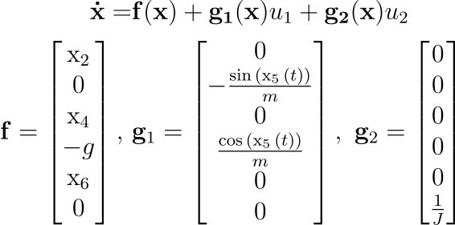
</p>

We employ ideas from nonlinear control theory and differential geometry to investigate the controllability of the plant.

**Theorem:** System $\dot{x}=f(x)+g(x)u$ with $x \in \mathbb{R}^n$ and $u \in \mathbb{R}^m$ is controllable if distribution $\Delta_{c2}$, the smallest distrribution spanned by columns of $g$, $span\{g_1, g_2\}$, and invariant to $g_1, g_2, f$, has rank $n$. 

Let's first instantiate a robot and get the symbolic system equations as follows:

```python
from DiffFlatQuad.robot import PlanerQuadrotor
robot = PlanerQuadrotor(rendering=False)

# Get the sympy symbolic expressions describing the plant
f = robot.getSymbolicF()
g = robot.getSymbolicG()
x = robot.symbolic_state
g1 = g[:,0]
g2 = g[:,1]
t = sp.symbols('t')
```
Then, use the following two helper functions to compute the Lie derivatives and brackets for the next step:

```python
def lieDerivative(a, b, x):
    """ 
    returns the L_a(b)
    """
    return b.jacobian(x)*a

def lieBracket(a,b,x):
    """
    returns the Lie bracket [a,b] = L_{a}b - L_{b}a
    """
    return lieDerivative(a, b, x)-lieDerivative(b, a, x)
```

**Reminder:** Distribution $\Delta$ is said to be invariant to be invariant to vector field $f$ if for all $\tau \in \Delta$, Lie bracket $[\tau, f]$ is also in $\Delta$.

To find the distribution $\Delta_{c2}$, we simply start with $\Delta = span\{g_1, g_2\}$ and compute the Lie brackets between $g1, g2$ and $f,g1,g2$ and add the result to the distribution if it's not already part of it. We continues this process until the rank of $\Delta_{c2}$ stops growing:

<p align="center">
  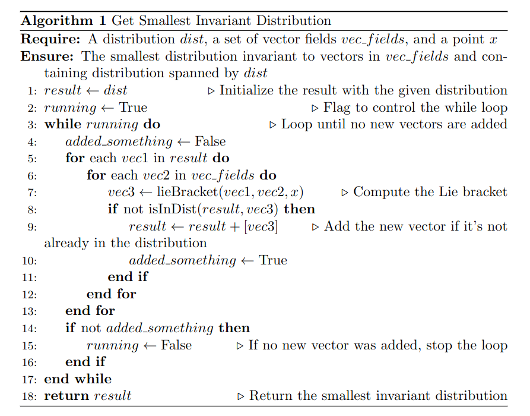
</p>

The Python implementation of this is:

```python
def isInDist(dist, vec):
    """
    Is vec in distribution dist?
    """
    d = dist[0].copy()
    for i in range(len(dist)-1):
        d = d.row_join(dist[i+1])
    rank1 = d.rank()
    d = d.row_join(vec)
    rank2 = d.rank()
    if rank2 > rank1:
        return False
    else:
        return True
    
def getDistRank(dist):
    """
    return the rank of distribution spanned by a list of vecs in dist
    """
    d = dist[0].copy()
    for i in range(len(dist)-1):
        d = d.row_join(dist[i+1])
    return d.rank()

def getSmallestInvariantDistribution(dist, vec_fields, x):
    """
    Returns the smallest distribution invariant to vectors in the 
    vec_fields list and containing distribution spanned by the 
    vector fields in the dist list. 
    """
    running = True
    result = []
    result +=dist
    while running:
        added_something = False
        for vec1 in result:
            for vec2 in vec_fields:
                vec3 = lieBracket(vec1, vec2, x)
                if not isInDist(result, vec3):
                    result +=[vec3]
                    added_something = True
        if not added_something:
            running = False
    
    return result
```

Using these functions, we can now compute the $\Delta_{c2}$ for our quadrotor plant. The result is shown in the following and its rank is 6, which is equal to the number of states and implies that the system is controllable.

<p align="center">
  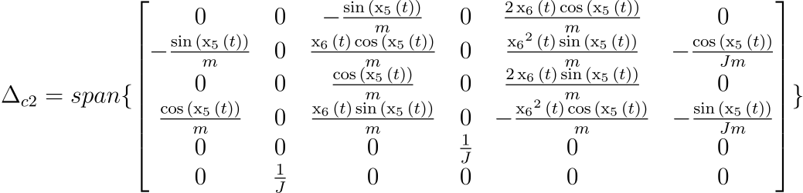
</p>

## Controlling The Robot and Differential Flatness

Now that the controllability of the system is shown, we can move on to designing a controller for the robot. We will first define differentially flat systems and then we will use it to design a controller. 

### Differentially Flat Systems

System $\dot{x} = f(x,u)$, $x \in \mathbb{R}^n$ and $u \in \mathbb{R}^m$ is said to be differentially flat if there exists a function $z = \alpha(x,u, \dot{u}, ..., u^{(p)})$ from state and time derivatives of input to a set of outputs $z$ equal in number to the number of inputs such that we can reconstruct the whole state and input trajectory given the flat output $z$ and its time derivatives without integrating the dynamics:
<!-- 
x = &\beta(z,u, \dot{z}, ..., z^{(q)})\\
u = &\gamma(z,u, \dot{z}, ..., z^{(q)}) -->
<p align="center">
  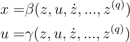
</p>

#### The Planar Quadrotor
For our planar quadrotor, the center of mass position $x_1,x_3$ are the flat outputs based upon which, the state and input trajectories may be computed as follows ([a great video showing this](https://www.youtube.com/watch?v=ohBJ0BCtZWQ)):

<!-- \left[\begin{matrix}\operatorname{{x}_{1}}{\left(t \right)}\\\operatorname{{x}_{2}}{\left(t \right)}\\\operatorname{{x}_{3}}{\left(t \right)}\\\operatorname{{x}_{4}}{\left(t \right)}\\\operatorname{{x}_{5}}{\left(t \right)}\\\operatorname{{x}_{6}}{\left(t \right)}\end{matrix}\right] = 
\left[\begin{matrix}\operatorname{x_{1}}{\left(t \right)}\\\frac{d}{d t} \operatorname{x_{1}}{\left(t \right)}\\\operatorname{x_{3}}{\left(t \right)}\\\frac{d}{d t} \operatorname{x_{3}}{\left(t \right)}\\\operatorname{atan_{2}}{\left(- \frac{d^{2}}{d t^{2}} \operatorname{x_{1}}{\left(t \right)},g + \frac{d^{2}}{d t^{2}} \operatorname{x_{3}}{\left(t \right)} \right)}\\- \frac{\left(g + \frac{d^{2}}{d t^{2}} \operatorname{x_{3}}{\left(t \right)}\right) \frac{d^{3}}{d t^{3}} \operatorname{x_{1}}{\left(t \right)}}{\left(g + \frac{d^{2}}{d t^{2}} \operatorname{x_{3}}{\left(t \right)}\right)^{2} + \left(\frac{d^{2}}{d t^{2}} \operatorname{x_{1}}{\left(t \right)}\right)^{2}} + \frac{\frac{d^{2}}{d t^{2}} \operatorname{x_{1}}{\left(t \right)} \frac{d^{3}}{d t^{3}} \operatorname{x_{3}}{\left(t \right)}}{\left(g + \frac{d^{2}}{d t^{2}} \operatorname{x_{3}}{\left(t \right)}\right)^{2} + \left(\frac{d^{2}}{d t^{2}} \operatorname{x_{1}}{\left(t \right)}\right)^{2}}\end{matrix}\right] -->

<p align="center">
  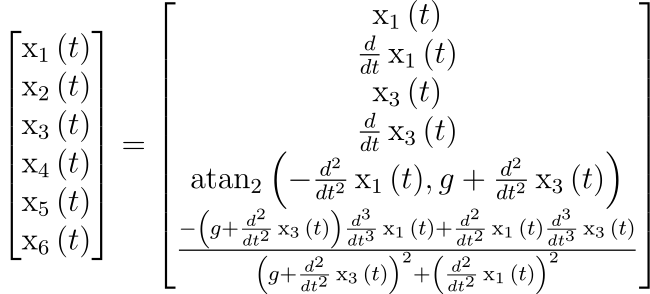
</p>
<!-- \mathbf{u} = \left[\begin{matrix}m \sqrt{\left(g + \frac{d^{2}}{d t^{2}} \operatorname{x_{3}}{\left(t \right)}\right)^{2} + \left(\frac{d^{2}}{d t^{2}} \operatorname{x_{1}}{\left(t \right)}\right)^{2}}\\\frac{J \left(2 \left(\left(g + \frac{d^{2}}{d t^{2}} \operatorname{x_{3}}{\left(t \right)}\right) \frac{d^{3}}{d t^{3}} \operatorname{x_{1}}{\left(t \right)} - \frac{d^{2}}{d t^{2}} \operatorname{x_{1}}{\left(t \right)} \frac{d^{3}}{d t^{3}} \operatorname{x_{3}}{\left(t \right)}\right) \left(\left(g + \frac{d^{2}}{d t^{2}} \operatorname{x_{3}}{\left(t \right)}\right) \frac{d^{3}}{d t^{3}} \operatorname{x_{3}}{\left(t \right)} + \frac{d^{2}}{d t^{2}} \operatorname{x_{1}}{\left(t \right)} \frac{d^{3}}{d t^{3}} \operatorname{x_{1}}{\left(t \right)}\right) - \left(\left(g + \frac{d^{2}}{d t^{2}} \operatorname{x_{3}}{\left(t \right)}\right) \frac{d^{4}}{d t^{4}} \operatorname{x_{1}}{\left(t \right)} - \frac{d^{2}}{d t^{2}} \operatorname{x_{1}}{\left(t \right)} \frac{d^{4}}{d t^{4}} \operatorname{x_{3}}{\left(t \right)}\right) \left(\left(g + \frac{d^{2}}{d t^{2}} \operatorname{x_{3}}{\left(t \right)}\right)^{2} + \left(\frac{d^{2}}{d t^{2}} \operatorname{x_{1}}{\left(t \right)}\right)^{2}\right)\right)}{\left(\left(g + \frac{d^{2}}{d t^{2}} \operatorname{x_{3}}{\left(t \right)}\right)^{2} + \left(\frac{d^{2}}{d t^{2}} \operatorname{x_{1}}{\left(t \right)}\right)^{2}\right)^{2}}\end{matrix}\right] -->
<p align="center">
  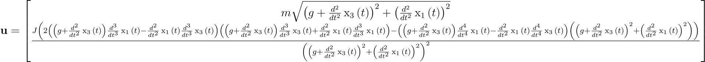
</p>

Note that the highest degree of flat output derivative is 4 which corresponds to the snap. Therefore, the designed desired trajectory must be smooth up to the 4th order and to avoid actuation saturation, minimum-snap trajectories should be designed. 

### Open-Loop Control
Given the mappings from the desired flat output and the corresponding derivatives to the inputs and states, we can perform a simple test to see how the simulated quadrotor behaves when subjected to the computed input commands. Ideally, the drone should perfectly follow the desired trajectory. 

For the sake of simplicity, we chose a circular trajectory parametrized as $x=cos(\omega t), y=sin(\omega t)$ as reference trajectory and computed its derivatives up to the 4'th order (Look at `controller.ipynb` notebook). After applying the corresponding computed inputs to the simulated quadrotor, get the following response:

<p align="center">
  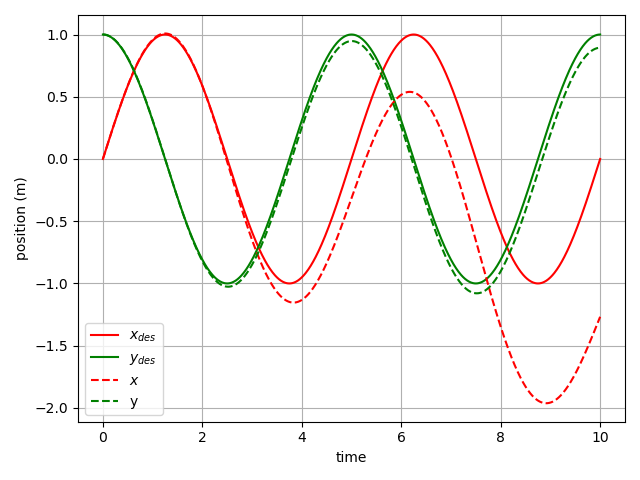
</p>

As we can see, even though initially the drone stays close to the desired trajectory, after a short amount of time it deviates as there are no feedback loops to correct for the numerical inaccuracies (in this case forward Eular integration errors). To account for this, we need the magic of feedback!

### Close-Loop Control

In this section, we use the methodology described in [here](https://arxiv.org/abs/1712.02402). First, we design a simple PI body rate controller. This is a common practice in the drone industrey to control the body angular rate of the drone through the gyroscope measurements feedback to regulate the body torques. As mentioned earlier, the system dynamics from torque to body rate is a simple single integrator and is decoupled from the positional states (neglecting aerodynamic effects).

The PI controller is implemented as follows:

```python
class PIController():
    def __init__(self, n, Kp, Ki, dt=0.01):
        self.dt = dt
        self.Kp = Kp
        self.Ki = Ki
        self.n = n
        self.e_integrated = np.zeros((n,1))
    def reset(self):
        self.e_integrated = np.zeros((self.n,1))    

    def update(self, x, x_des):
        e = x_des - x
        self.e_integrated += e * self.dt
        return self.Kp*e + self.Ki*self.e_integrated
```

The application of this controller to the simulated drone with $K_p=10, K_i=0.1$ yields the following tracking performance:

<p align="center">
  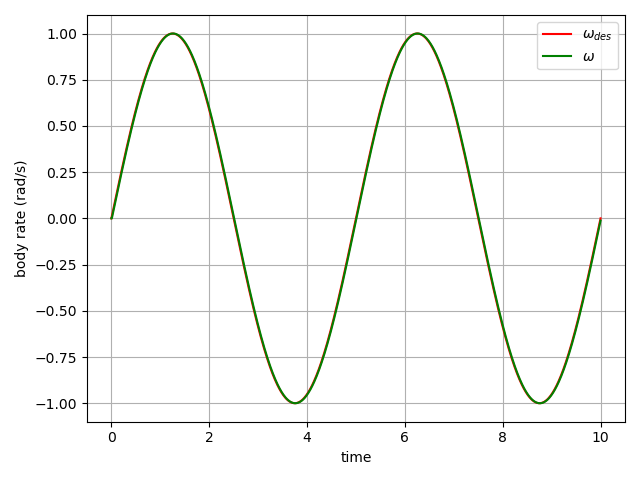
</p>

Having this inner-loop body rate controller, we can move on to the outer-loop position controller. Given the desired position and velocity of the robot, we compute a desired acceleration using a PD control law as follows:
<!-- 
$
a_{\text{des}} = K_p(\mathbf{x}-\mathbf{x}_{\text{des}})+K_v(\mathbf{v}-\mathbf{v}_{\text{des}}) + g \mathbf{z}_w
$ -->
<p align="center">
  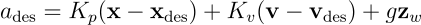
</p>

Here, $\mathbf{z}_w$ is the world frame z-axis direction. We project this acceleration on the body-z-axis of the drone ($\mathbf{z}_B$) as follows:
<!-- F = m \times \mathbf{a}_{des}^T\mathbf{z}_B -->

<p align="center">
  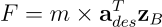
</p>

Furthermore, we control the body orientation ($\theta$) such that the body z-axis ($\mathbf{Z}_B$) aligns with the direction of the desired acceleration. The implementation of this attitude controller is provided in `controller.ipynb`. The output of this controller is the desired body angular velocity ($\omega_{des}$) which is fed to the inner loop body rate controller to track. 

Implementing this on the simulated robot leads to the following tracking performance:

<p align="center">
  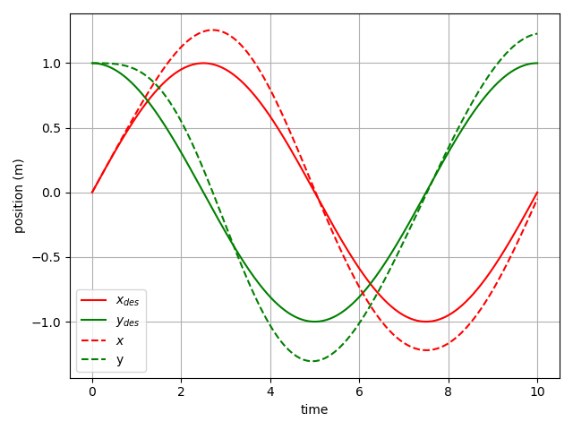
</p>

We note that the robot is not able to accurately track the desired trajectory. This is due to the fact that the controller in this section has no feed-forward terms and the drone has to encounter a tracking error to produce corrective action. 

#### Incorporation of Feed-Forward Terms

Now that we have a quadrotor with close-loop position feedback, we can use the differential flatness analysis we performed earlier to compute feed-forward terms for the body rate and thrust controllers to eliminate the drift we saw in the previous section. In other words, in this section, the feed-forward terms from the differential flatness studies will guide the drone along the desired trajectory while the PD controller corrects for the numerical integration errors and other sources of uncertainty to keep the drone on track.

To do this, we simply add a feed-forward acceleration term to the desired acceleration computed in the previous section and compute the thrust command as $F = m \times (\mathbf{a}_{des}+\mathbf{a}_{ref})^T\mathbf{z}_B$. Additionally, we use the $\beta(.)$ function to get the body angular rate corresponding to the desired flat-output trajectory and add it to the $\omega_{des}$ from the previous section before feeding it to the body rate controller. With this modification, we achieve the following result:

<p align="center">
  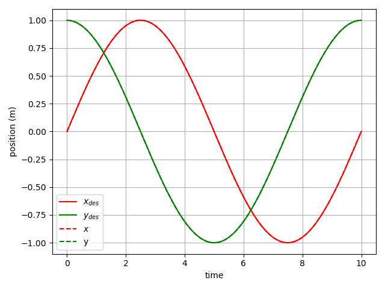
</p>

As expected, the drift is completely eliminated and the drone sticks to the desired trajectory very closely.

## Conclusion
This project provided a simple toy example that to illustrate the ideas behind exploiting the differential flatness of quadrotor dynamics for accurate pose tracking of this wonderful robot. These ideas can be easily extended to the full 3D quadrotor system. In the future, this extension will be done and a link to it will be added [here]().
